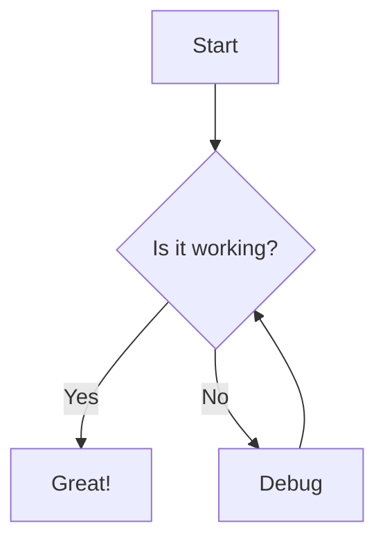
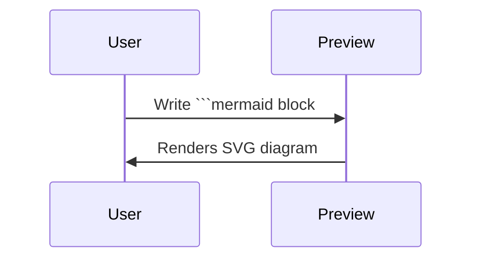

# Mermaid Example

This MDX file demonstrates Mermaid diagram support. Any fenced code block
tagged `mermaid` is rendered as a diagram in the preview.

To preview: open the command palette and run **MDX: Open Preview**, or click
the magnifying glass in the editor title bar.

## Flowchart



## Sequence Diagram



## Regular code blocks are unaffected

```js
const greeting = 'hello world';
console.log(greeting);
```
